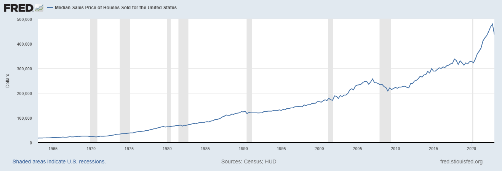
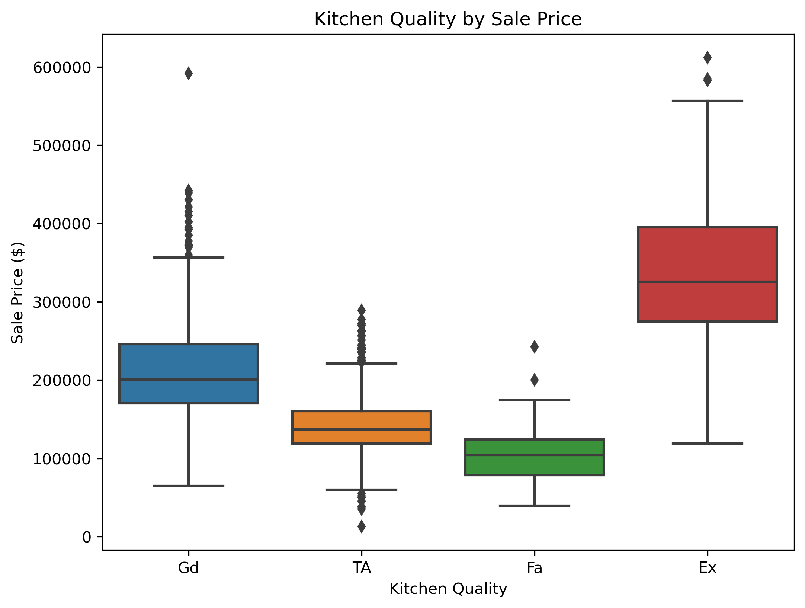
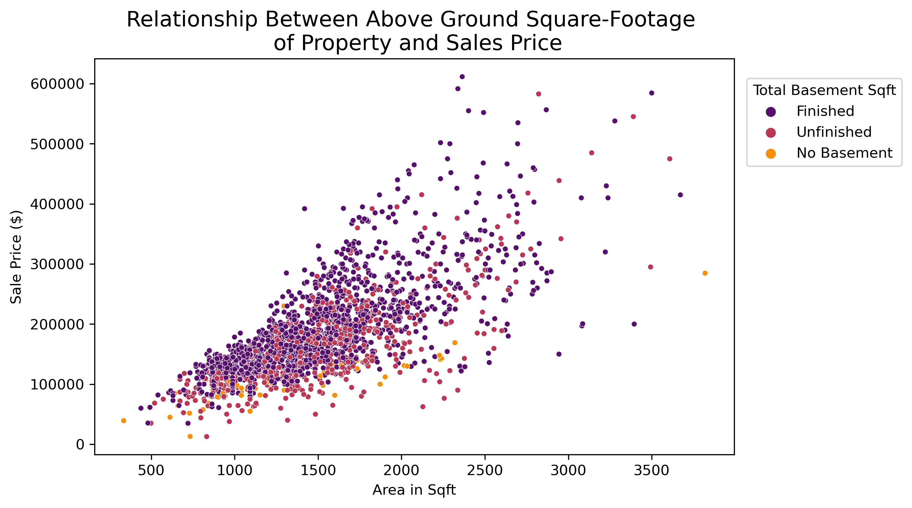
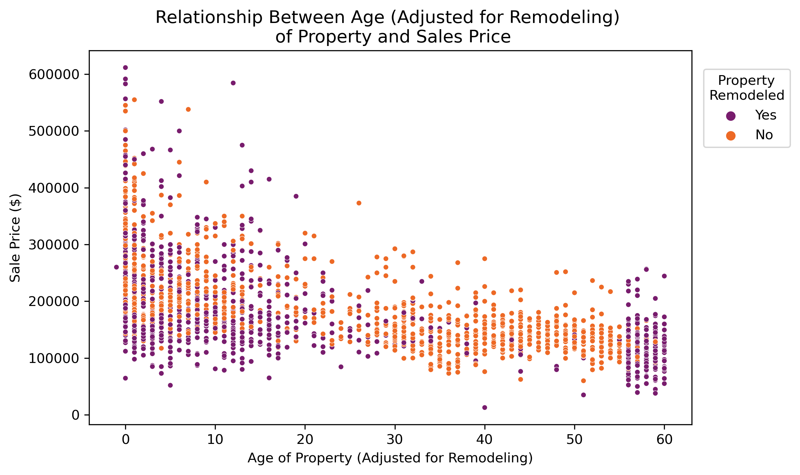
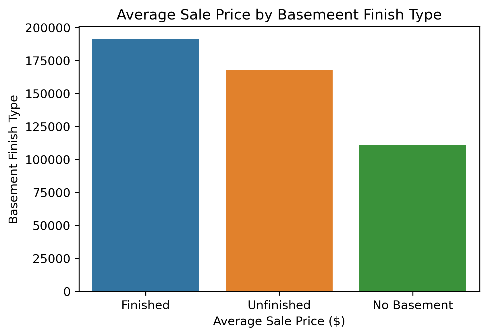
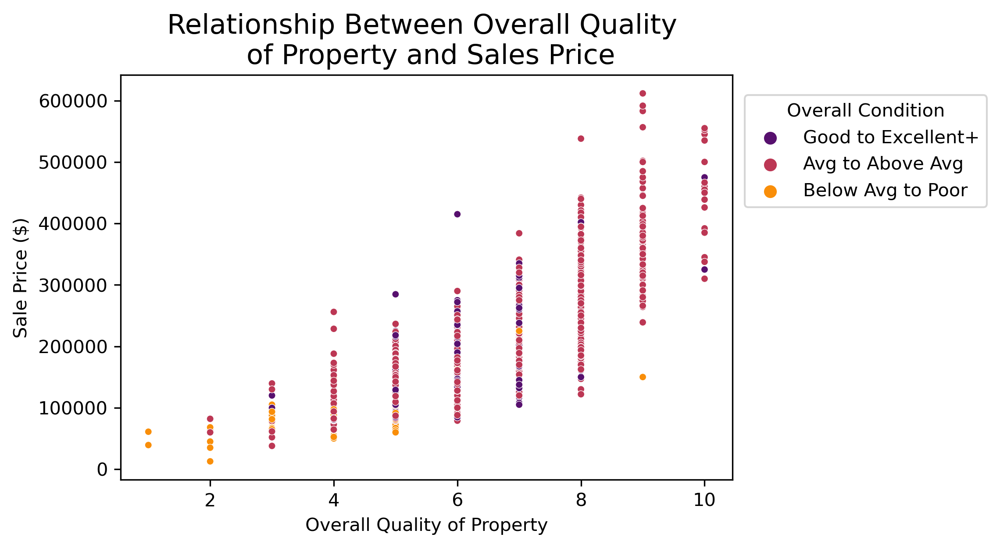

# Predicting Sales Price Using Ames, IO Housing Data
---

# Problem Statement
In today's highly dynamic housing market, where sales prices are in a constant state of flux and on an upward trajectory, it is becoming increasingly important to make informed choices about finding the right home. This decision will impact not only ones immediate quality of life but also future financial opportunity. Housing prices have increased by 48.55% over the last decade and experts project they will continue to rise into the future ([*1*](https://www.cnbc.com/select/how-much-will-a-home-in-the-us-cost-by-2030/)). By identifying trends and understanding how different factors affect each other, potential or current homeowners may be able to maximize the net worth of their properties and strategically buy, remodel, or maintain homes that will appreciate. 

In this analysis we built a linear regression model (using LassoCV regularization and testing RidgeCV regularization) of key features which can be used in predicting house prices. We started by exploring and cleaning our data ([first notebook](../code/01_EDA_and_Cleaning.ipynb)) , transforming our variables into model-ready form ([second notebook](../code/02_Feature_Engineering.ipynb)), and ultimately iterating across various features to find which ones are most associated with sales price after accounting for the interplay between variables ([third notebook](../code/03_Model_Building.ipynb)). Using our model, potential and seasoned homeowners will understand which features to look for in a home to maximize the return on their investment - either by way of a longterm satisfaction with their property or by high resale value.

# Data Dictionary

The main data frame used in this exploration was the Ames, Iowa Housing Dataset. This data frame holds details on over 2000 properties sold between 2006-2010. It provides an extensive range of information ranging from location, quality, physical attributes of the property, and sale price.

A data dictionary of the Ames, Iowa Housing Dataset can be found [*here*](https://jse.amstat.org/v19n3/decock/DataDocumentation.txt). A few additional variables tha were built off variables within the Housing Dataset are listed below.

|Feature|Type|Dataset|Description|
|---|---|---|---|
|**age**|*integer*|Ames, Io Housing Dataset|Age of property, calculated as Year Sold - Year Built | 
|**age_adj**|*integer*|Ames, Io Housing Dataset|Age of property accounting for remodeling such that if a home was remodeled, it's age was reset to 0 | 
|**hi_bsmt_exposure**|*integer*|Ames, Io Housing Dataset|Binary indicator referring to whether a home as high or average basement exposure |
|**amenities_scr**|*integer*|Ames, Io Housing Dataset|Score created to quantify household amenities, made up of various features including high basement exposure, presence of pool, near or adjacent to a positive offsite feature, or having a lot configuration of Cul De Sac |
|**nbr_rank**|*integer*|Ames, Io Housing Dataset|An average neighborhood rank generated by aggregating across home-level scores/rankings per neighborhood in several categories including median home sales price, home overall quality, home exterior quality, home functionality, and number of nearby amenities|
|**avg_eng**|*float*|ACT_CA_COUNTY|The average ACT English score of students across schools within the CA county (based on 2019 data))|

# Executive Summary

## Purpose
With the increasing and consistent rise of housing prices over the last decade, it is more important than ever for individuals to make informed decisions in finding the right home for themselves. Homeowners stay in their homes for a median of 13 years [*2*](https://www.nar.realtor/blogs/economists-outlook/how-long-do-homeowners-stay-in-their-homes), and in this time it is important to undestand the proper upkeep needed to have selling options in the future and continue to build wealth and maximize their return on their investments.

source: https://fred.stlouisfed.org/series/MSPUS

This project sought to further explore the key features that are associated with home sale price and model these features to understand the magnitude of impact each feature had, as well as create a comprehensive way to predict home sale prices. This analysis will help 1) future home-buyers to understand what features to look for in a property (fixed features and physical), and 2) current homeowners to understand what physical attributes they may be able to update in their homes to increase the potential for resell and appreciation.

## Initial Findings
Our model took in many key features that explained 84% of the variability in sale prices, whilst keeping the spread of residual errors fairly low (RMSE = 23357). The high-level key features included:
- Overall Quality
- Age of Property
- Time since last remodel
- Square-footage (above ground and basement)
- Garage Finished Status
- Proximity to various conditions (arterial street, feeder street, railroad, parks, etc.)
- Neighborhoood Rank
- Lot Configuration

## Methodology and Analysis
The complete this analysis, a Linear Regression model was built using LassoCV regularization. Multiple iterations of key features were run through various models (e.g., model using log-transformed target variable, with/without LassoCV and RidgeCV regression), before a final model was decided upon based on R^2 and RMSE values. The high-level process for this analysis is outlined below.

#### 1. Data Acquisition and Cleaning
The Ames, Iowa Housing Dataset was reviewed, split into a testing and a training dataset, and cleaned. The following steps were iterated until the data was clean enough for exploration and visualization.
- Descriptive statistics exploration for anomalous data
- Data type updates
- Filtering outliers or otherwise updating anomalous data
- Missing data processing
        - If a feature existed (e.g., a fireplace, a basement, a garage), and has a missing value, the missing value was filled in with the average of observation for that feature (if continuous) or with the mode of observations (if discrete or categorical)
        - If a feature did not exist, continuous variables were imputed with 0 and categorial values were imputed with NA for No [Feature]
   
#### 2. Data Exploration and Visualization
Various features were explored and visualized during this step. Each feature was looked at separately and, where possible, with other variables to gauge patterns and insights. The following variables were reviewed and findings were used to inform further data cleaning and data dropping.
- Zoning Areas
- Price by Year Sold and Year Remodeled
- Lot Configuration
- Neighborhoods by Overall Quality and Condition, Desirable Location Features (Proximity to Various Conditions)
- Age of House (Original and Remodeled) and Sale Price
- Impact of Basement, Fireplace, Garage, Kitchen

Visualizations were included in each exploration, mainly including:
- Scatterplots, pairplots, histograms, or correlation matrices/heatmaps for all continuous variables
- Barplots or boxplots for categorical variables or discrete with small ranges

#### 3. Data Manipulation and Feature Engineering
After data cleaning and exploration, the data was further tranformed to be in model-ready shape. In this step, several important decisions were made:
- The distribution of the target variable (SalePrice) was found to heavily right skewed. This variable was log-transformed for normality and achieved a hence took on a more normal shape for modeling.
- All continuous predictor variables of interest were reviewed for skewedness following the formula (3*(mean-med))/stdev. The variables were either not very skewed, or were left as is because log-transforming them did not achieve normality.
- Categorical variables were reviewed and the following steps were taken
    - If ordinal, these variables were often converted to a numeric form
    - If nominal, these variables were reviewed and sometimes categories were combined (for example, seven basement condition variables were transformed into 3: Finished, Unfinished, and No Basement)
    - One Hot Encoding was performed, and variables in the trianing set that did not exist in the testing set were ignored
 
Several new variables were generated, often with the goal of capture a large amount of information in one variable, such that one variable could be fed into the model rather than multiple. Some examples of this include:
- An amenities score which consisted of features commonly associated with higher sale prices such as high basement exposure, presence of a pool, proximity to features such as parks, and a Cul De Sac lot configuration.
- Location was scored by creating a neighborhood rank. To achieve this, averages by neighborhood were taking for the following variables:
    - Sales prices
    - Overall Quality Scores (omitted Overall Condition as it seems less integral to sale prices (compared to quality) according to EDA)
    - Exterior Quality Scores (omitted Overall Condition as it seems less integral to sale prices (compared to quality) according to EDA)
    - Home functionality (damages or deductions)
    - Average Amenities Score
- These scores were then ranked into quintiles (Bottom average scores were in Quintile 1 and recieved a rank of 1, Top average scores were in Quintile 5 and recieved a rank of 5), these ranks were merged into the larger data by neighborhood, and all ranks were added together to create a neighbhorhood score and used in the model to account for location desirability and its impact on Sale Price.

#### 4. Data Modeling
Once our data was completed cleaned, manipulated, and features were engineered, data modeling took place. In this step, all features from the data exploration were trialed and tested in a multiple linear regression model and R^2s and RMSE's were recorded. Variables were added and ommitted until the model began to become more robust. 

One model was predicting on non-log-transformed Sale Price, whilst another was testing on log-transformed Sale Price. The log-transformed version was yielding a better model (higher R^2 and lower RMSE) than the non-log-transformed version, therefore the log-tranformed version was ultimately used. 

Under the linear model where the target variable (Sale Price) was log-transformed, our training and testing R^2 were approximately 5% different: 90% and 85%, respectively. This indicated some overfitting and was interpreted as: ~85% of the variability in Sale Price can be explained by the features used in our model. With an RMSE of 23,356 (fitted on the whole data), this model does a much better job than the null model of predicting Sale Price (null_RMSE: 80,066).

To address overfitting, both RidgeCV and LassoCV regularization were performed. LassoCV was yielding a strong model and ultimately that model was chosen as the final model for this analysis. Under the linear model using LassoCV regularization where the target variable (Sale Price) was log-transformed, our training and testing R^2 were still approximately 6% different: 90% and 84%, respectively. This was still indicative of overfitting and was interpreted as: ~84% of the variability in Sale Price can be explained by the features used in our model. With an RMSE of 23,357 (fitted on the whole data), this model does a much better job than the null model of predicting Sale Price (null_RMSE: 80,066).

While the training R^2 was larger than the testing R^2, neither Ridge nor Lasso CV regularization appeared to be addressing the overfitting. This was the case after several iterations of changing the strength of the regularization (alpha), as well as removing variables to make the model simpler, and increasing/decreasing the number of cross-validations performed. Each scenario resulted in the RMSE score increasing and R^2 either remaining constant or decreasing slightly.

Still, this model was the strongest in that it had the good R^2, a smaller RMSE relative to the null model and other models that were run in comparison, and was fitted to address overfitting.

#### 5. Key Findings and Insights 

Based on this exploration, there were many insights drawn about key features in predcting sale prices.

    
**Some noteable model features included:
- **_Kitchen Quality_**: Holding all other variables constant, having a kitchen in Fair/Good/Average quality vs. Excellent quality decreased the predicted Sale Price by up to 6%. Regularization decreased the impact of beta coefficients on our target variable.

- **_Living Area Square-Footage (Above and Below Ground)_**: Holding all other variables constant, per every one unit increase in the above ground square-footage, Sale Price was predicted to increase by 13.5%. Also, per every square-footage increase in basement area, the predicted Sale Price was expected to increase by 6%, holding all else constant.

- **_Age_**: For every one year increase in age of property, the Sale Price was predicted to decrease by 13%, holding all other variables constant.

- **_Year Remodeled_**: Holding all other variables constant, per every year increase in remodeling year (i.e., the more recently the property was remodeled), the Sale Price was predicted to increase by 4%.

- **_Garage Quality vs. Finished Status_**: Holding all other variables constant, per every one unit increase in the garage quality (ordered from None, Poor, Fair, Average, Good, Excellent), the predicted Sale price was expected to increase by 5%. However, having a finished, rough finished, or unfinished garage, compared to no garage, appeared to be decrease the predicted Sale Price from 4-5.5%, holding all else equal. These results are unexpected and could potentially be due to multicollinearity taking place in the model between these features.

- **_Basement Finished Status_**: Holding all other variables constant, having a finished basement predicted an increase of 1.6% in Sale Price, compared to no basement. However, having an unfinished basement actually predicted a 2$ decrease in Sale Price, holding all else equal.

- **_Neighborhood Rank_**: Holding all other variables constant, per every unit increase in neighborhood rank*, the Sale Price was predicted to increase by 4%.
- **_Overall Quality vs. Condition_**: For every one-point increase in the overall quality score of the property, sales price was predicted to increase by 10%, holding all else constant. Overall Quality (holistic evaluation focusing on factors such as materials used, finish, and design) 
seemed to be a more significant predictor than Overall Condition (overall maintenance, repair, and livability)

*Neighborhood rank = a variable created by scoring neighborhoods based on their rankings in median Sale Price (based on training data), average Overall Quality, average Exterior Quality, average functionality score, and average access/amenities score

#### 6. Conclusion and Next Steps

There are five main insights that future home-buyers and current homeowners can take away from this analysis which will help them position themselves for maximum financial opportunity in the future. These resulted from a combination of the data exploration and modeling activities:

1. Focus on Quality over Condition - Review Materials, Finishes, Design (especially for Garage and house exteriors)
2. Search for larger homes with basements (finished or unfinished)
3. Buy newer houses or houses remodeled within the last 20 years
4. Look for properties within proximity to positive offsite features such as parks, greenbelts, etc.
5. For some items, such as Fireplaces and Kitchens, only build/buy these in Excellent or Good condition. For fireplaces, any less is associated with returns similar to not having the feature at all. For kitchens, homes with the hgihest sales values had Excellent kitchens.

Using this information, the audience of home-buyers and homeowners is ready to take steps toward building their wealth.

More data and continuing investigations will be helpful in predicting the relationship between Sale Price and key home features. Incorporating new elements into our linear model which may make it more robust, or employing other techniques to cure any potential overfitting and explain the remaining variability in Sale Price are productive next steps for this subject matter.

